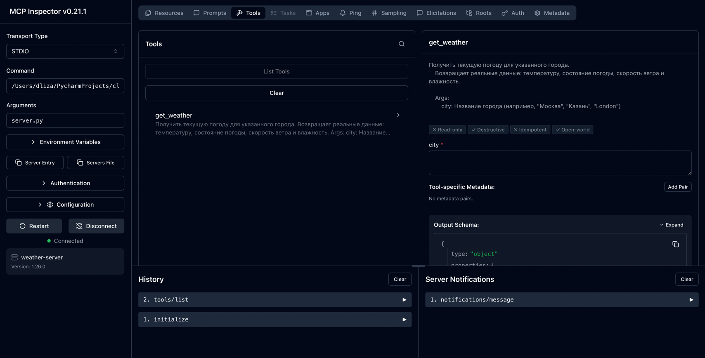
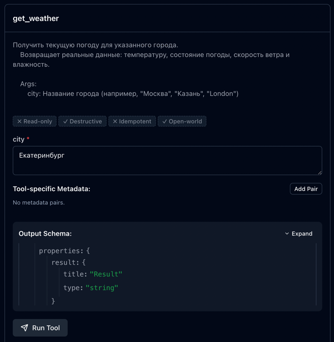
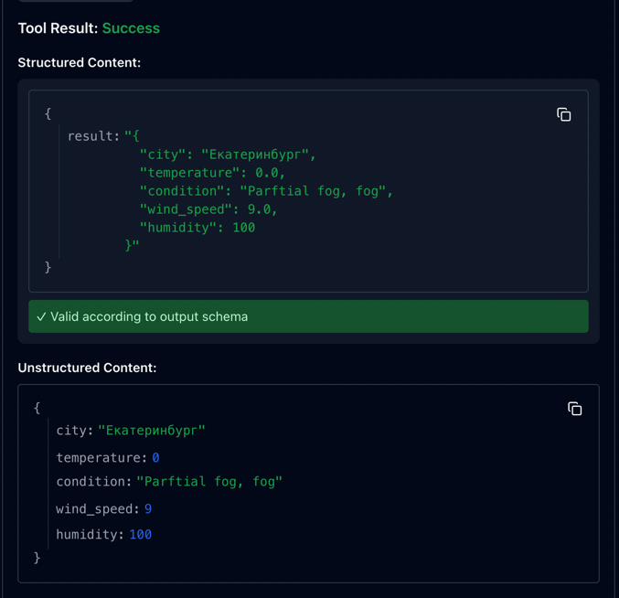

# Домашнее задание #3: Первый MCP-сервер

## MCP Inspector

## Секция 1: Топ-3 MCP-серверов

### #1: Android-MCP (CursorTouch)
**Ссылка:** https://github.com/CursorTouch/Android-MCP  

**Что делает:** MCP-сервер подключается к телефону через ADB и позволяет модели управлять им: нажимать кнопки, вводить текст, свайпать, открывать приложения, читать уведомления.  

**Какие tools предоставляет:**
- **State-Tool** — получает текущее состояние экрана и список интерактивных элементов
- **Click-Tool / Long-Click-Tool** — нажатия и долгие нажатия по координатам
- **Type-Tool** — ввод текста в поля
- **Swipe-Tool** — свайпы в нужном направлении
- **Drag-Tool** — перетаскивание объектов
- **Press-Tool** — нажатие аппаратных кнопок (Назад, громкость и т.д.)
- **Wait-Tool** — пауза между действиями
- **Notification-Tool** — чтение уведомлений устройства
- **Shell-Tool** — выполнение терминальных команд на устройстве

**Почему выбрала:** сервер позволяет модели тестировать приложения прямо на устройстве. Не нужно писать UI-тесты вручную, модель сама может пройтись по экранам, проверить, что кнопки работают, и найти баги. Это экономит кучу времени на ручном тестировании.

### #2: Sequential Thinking MCP
**Ссылка:** https://github.com/modelcontextprotocol/servers/tree/main/src/sequentialthinking  

**Что делает:** Помогает модели думать пошагово при решении сложных задач. Вместо того чтобы сразу выдать ответ, модель разбивает задачу на шаги, может пересмотреть предыдущие шаги, создать альтернативные ветки рассуждений и динамически менять план по ходу дела.

**Какие tools предоставляет:**  
- **sequential_thinking** — принимает текущий шаг размышления (`thought`), номер шага, оценку общего количества шагов, и флаги для пересмотра или ветвления. Модель может вернуться к любому шагу, пересмотреть его, создать альтернативную ветку решения или добавить дополнительные шаги, если задача оказалась сложнее.

**Почему выбрала:** Когда даёшь модели сложную задачу, она начинает сразу писать код. Sequential Thinking заставляет продумать каждый шаг. Особенно полезно для архитектурных решений и отладки.

### #3: GitHub MCP
**Ссылка:** https://github.com/github/github-mcp-server

**Что делает:** Официальный MCP-сервер от GitHub, который подключает модель напрямую к платформе GitHub. Позволяет через естественный язык работать с репозиториями, issues, pull requests, Actions и уведомлениями - без ручного переключения между вкладками.

**Какие tools предоставляет:**
- **repos** — просмотр кода, поиск файлов, анализ коммитов, структура проекта
- **issues** — создание, обновление и отслеживание issues
- **pull_requests** — создание, ревью и управление PR
- **actions** — мониторинг workflow, анализ сбоев сборки
- **code_security** — сканирование безопасности кода, анализ алертов Dependabot
- **discussions** — доступ к дискуссиям команды
- **notifications** — управление уведомлениями

**Почему выбрала:** Модель может сама создавать issues, делать ревью PR и проверять статус CI - не нужно каждый раз переключаться в браузер. Удобно, когда работаешь в терминале и хочешь всё делать из одного места.

## Секция 2: Топ-3 Skills для Claude Code

### #1: subagent-driven-development
**Ссылка:** https://github.com/obra/subagent-driven-development  

**Что делает:** Методология разработки, где Claude Code работает с несколькими специализированными сабагентами вместо одного агента. Каждый сабагент фокусируется на своей роли: дизайн система, написание кода, код ревью, отладка. Они взаимодействуют между собой, передавая контекст. Скил учит Claude координировать этих агентов, распределять задачи, управлять конфликтами мнений.   

**Почему выбрала:** Используя этот скилл Claude совершает меньше ошибок, так как каждыц сабагент проверяет свою зонну ответственности.  

### #2: Superpowers
**Ссылка:** https://github.com/coleam00/superpowers  

**Что делает:** Комплексная методология мульти-агентной разработки. Включает скиллы для brainstorming, TDD, планирования, debugging, code review, параллельного запуска агентов и финализации веток.  

**Почему выбрала:** Превращает Claude Code из простого кодогенератора в полноценную систему разработки с дисциплиной. Brainstorming не даёт писать код без продумывания, TDD заставляет начинать с тестов, а code review ловит ошибки до коммита.  

### #3: claude-android-skill
**Ссылка:** https://github.com/dpconde/claude-android-skill  

**Что делает:** Скил учит Claude писать Android-приложения по структуре, которую использует Google. Он знает, как разделить код на слои, как устроить папки в проекте, какие классы использовать.  

**Почему выбрала:** Потому что базируется на Google's NowInAndroid, как нужно разрабатывать Android приложения. Плюс он включает скрипт, который сам генерирует новые модули с правильной структурой, а не нужно каждый раз подсказывать Claude, как их организовать.  
